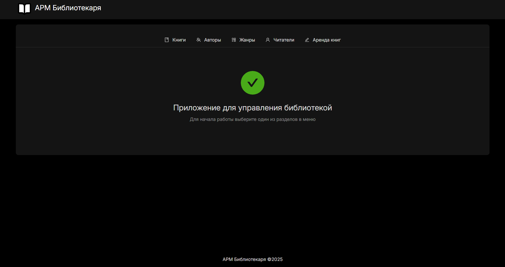
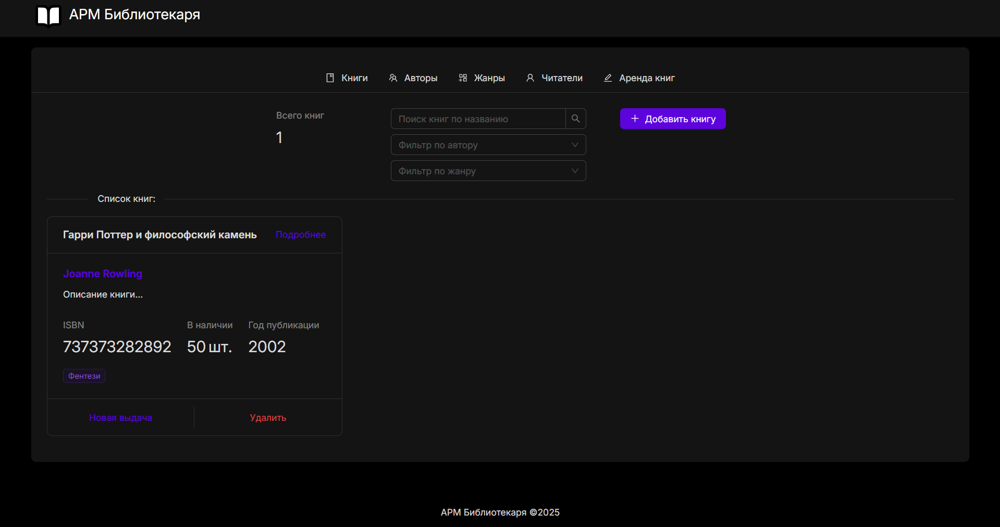
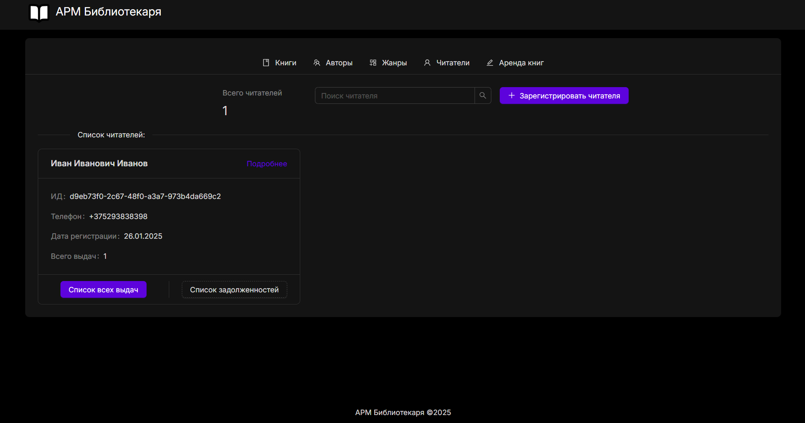
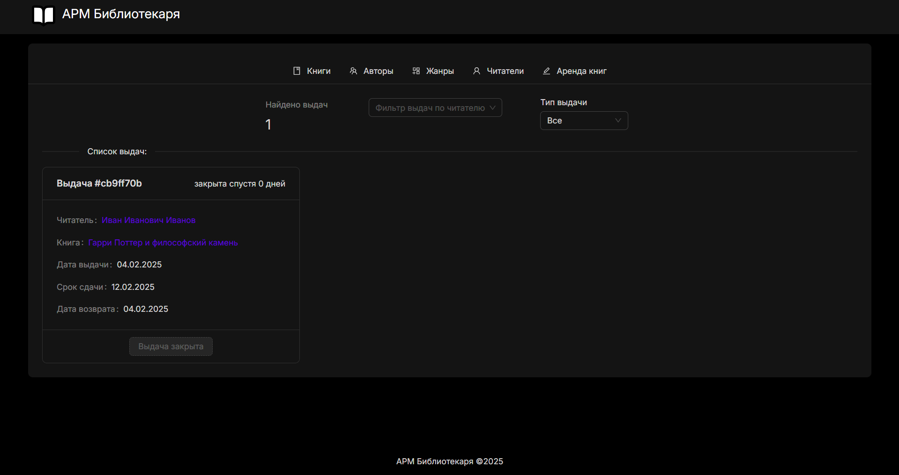
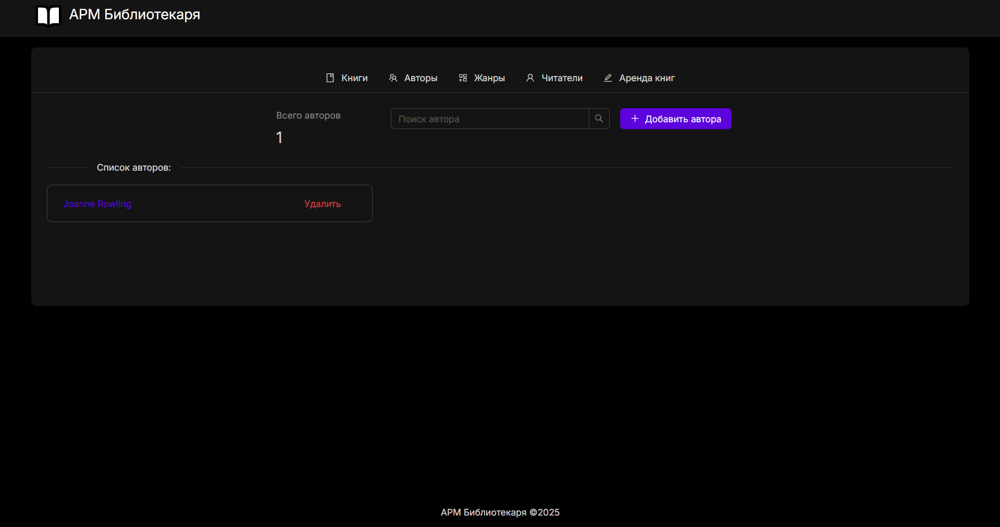

# Автоматизированное рабочее место библиотекаря

Фронтенд для проекта практики

_Ветка "vite" является предпочтительной_

[Backend этого приложения](https://github.com/kwknm/libraryworkstation-backend)

## Скриншоты

